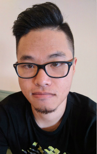

## Yang Zhang

My name is Yang Zhang. Currently, I am Ph.D. student under the supervision of [Dr. Hassan Foroosh](http://www.cs.ucf.edu/~foroosh/) and [Dr. Boqing Gong](http://boqinggong.info/) at University of Central Florida.

## Research Interest

Domain adaptation, Zero-shot learning, Semantic segmentation

## Publications

**Domain Randomization and Pyramid Consistency: Simulation-to-Real Generalization without Accessing Target Domain Data**. X. Yue, Y. Zhang, S. Zhao, A. Sangiovanni-Vincentelli, K. Keutzer, B. Gong.
International Conference on Computer Vision (ICCV) 2019 [[PDF](http://openaccess.thecvf.com/content_ICCV_2019/papers/Yue_Domain_Randomization_and_Pyramid_Consistency_Simulation-to-Real_Generalization_Without_Accessing_Target_ICCV_2019_paper.pdf)] [[Project/Code](https://github.com/xyyue/DRPC)]

**A Curriculum Domain Adaptation Approach to the Semantic Segmentation of Urban Scenes** Y. Zhang, H. Foroosh, P. David, B. Gong.
IEEE Transactions on Pattern Analysis and Machine Intelligence (TPAMI) 2019 [[PDF](https://ieeexplore.ieee.org/document/8661514)] [[Arxiv](https://arxiv.org/abs/1812.09953)]

**CAMOU: Learning Physical Vehicle Camouflages to Adversarially Attack Detectors in the Wild**. Y. Zhang, H. Foroosh, P. David, B. Gong.
International Conference on Learning Representations (ICLR) 2019 [[PDF](https://openreview.net/pdf?id=SJgEl3A5tm)]

**Curriculum Domain Adaptation for Semantic Segmentation of Urban Scenes**. Y. Zhang, P. David, B. Gong.
International Conference on Computer Vision (ICCV) 2017 [[PDF](https://arxiv.org/abs/1707.09465)] [[Project/Code](https://github.com/YangZhang4065/AdaptationSeg)]

**Infinite-Label Learning with Semantic Output Codes**. Y. Zhang, R. Acharyya, J. Liu, B. Gong.
arXiv:1608.06608. [[PDF](https://arxiv.org/abs/1608.06608)]

**Fast Zero-Shot Image Tagging**. Y. Zhang, B. Gong, and M. Shah.
Proceedings of the IEEE Conference on Computer Vision and Pattern Recognition (CVPR), Las Vegas, NV, June 2016. [[PDF](http://crcv.ucf.edu/people/faculty/Gong/Paper/fast0tag.pdf)] [[Supp.](http://crcv.ucf.edu/people/faculty/Gong/Paper/fast0tag-supp.pdf)] [[Project/Code](http://crcv.ucf.edu/projects/fastzeroshot/)] [[Presentation](https://www.youtube.com/watch?v=Pmv5JHKX2y4)]

